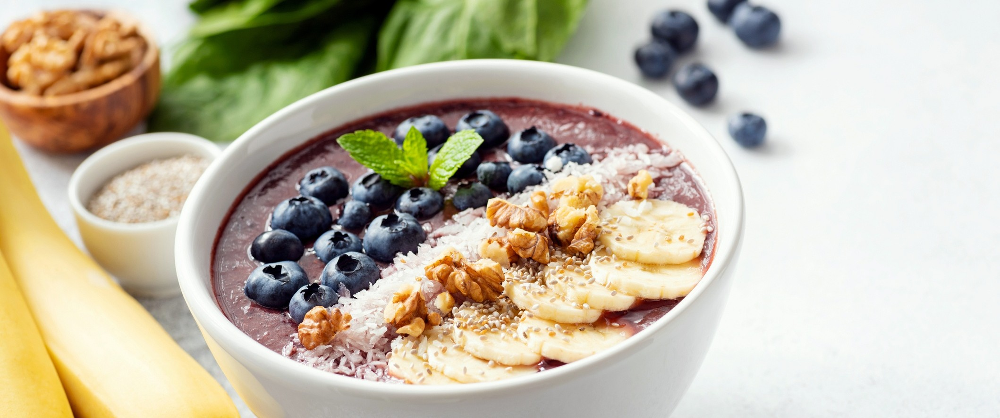
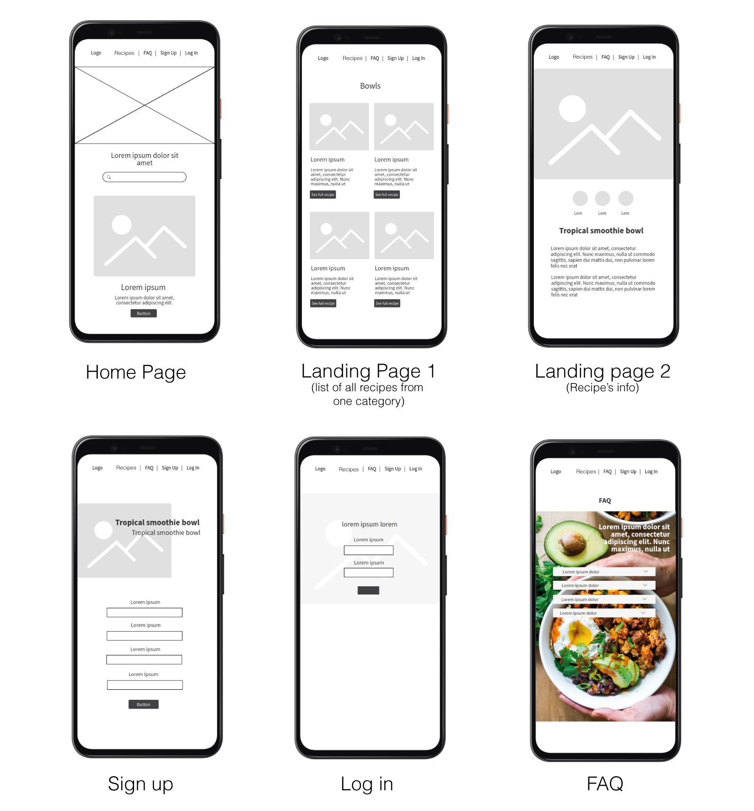

In Breakfas.t app you will find recipes to make varied healthy breakfast. If you're done with cheese and jam sandwitch Breakfas.t offers you alternatives to the typical breakfast menu still present in every coffee shop and bar. And last but not least, all our recipes are gluten free! 

***Breakfas.t*** was developed using JavaScript as part of the [Ironhack](https://www.ironhack.com/) developer bootcamp (WebDev-FT-092029) using the [Spoonacular](https://spoonacular.com/) API.

## Minimum Viable Product

The __MVP__ will cover the following:

- __Homepage:__ The homepage will present the apps concept and features and provide links to the rest of the site. A user will be able to search the recipe database by introducing his favorite ingredient or by selecting among different categories.
- __Recipes Page:__ All recipes related to the previous search will be displayed.
- __Recipes Product Page:__ The user will find the details of the selected recipe.
- __FAQ:__ Find the answers to breakfast recipes doubts.
- __Signup:__ A registration form for new users.
- __Login:__ A sign in form for existing users.

## Backlog ##

- New filters as difficulty and recipe cost
- Product detail recipe page

## Data Structure ##
- **root/**
     - index.html
     - recipes.html
     - faq.html
     - signup.html
     - login.html
     - **css/**
          - style.css
     - **js/**
          - api.js
          - signup.js
          - user.js
          - validator.js
          - login.js
          - categories.js
          - database.js
     - **assets/**
          - img

## Wireframes

## Links

### Trello
[Trello Kanban board](https://trello.com/b/6cjsvMI7/project-1)

### Git
[Gihub Repo URL](https://github.com/cristinacastro/Proyecto1.git)

### Spoonacular
[API Description](https://spoonacular.com/application/frontend/downloads/spoonacular-api-slides.pdf)

[API Documentation](https://spoonacular.com/food-api/docs)